# Background
This writeup lays out the actions I took to complete the ***USMA C3T 2019-2020 Winter Challenge***. The goal was to setup a network to host a website. This challenge uses the firewall *pfSense* to connect three virtual machines, *Ubuntu 18.04*, *CentOS Stream 8*, and *Alpine Linux*. *Nginx* was the webserver and *Unbound* was the DNS server.

# Set Up the Virtual Machines
## [Ubuntu Liver Server 18.02](http://releases.ubuntu.com/18.04/ubuntu-18.04.3-live-server-amd64.iso) 
1. Using [Oracle VirtualBox](https://www.virtualbox.org/wiki/Downloads),create a new VM with the following specfications:

|  |  |
| - | - |
| RAM | 1024 MB |
| Dynamically Allocated | True |
| Hard Disk Type | VDI |
| Hard Disk Size | 5 GB |s
| - | - |

| | |
|:-:|:-:|
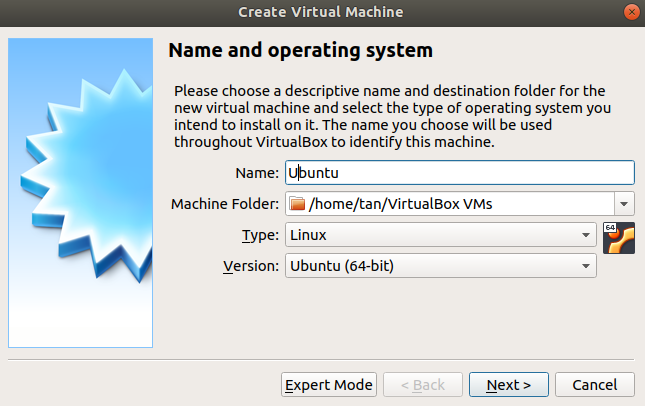  |  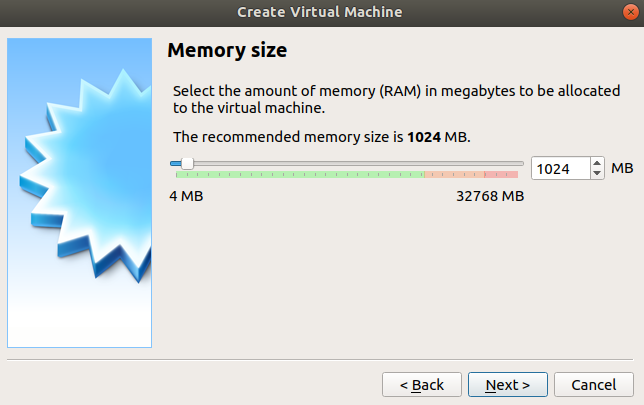
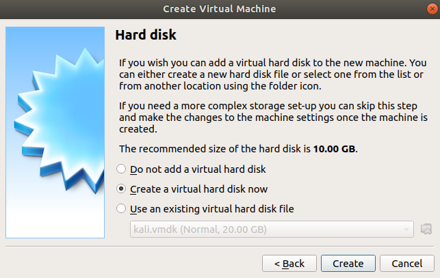  |  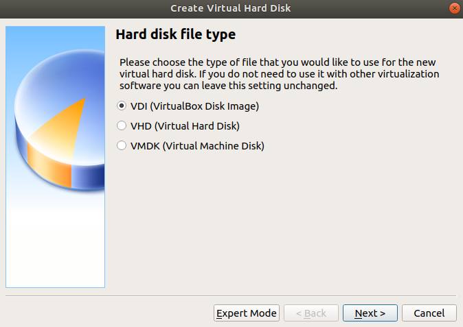
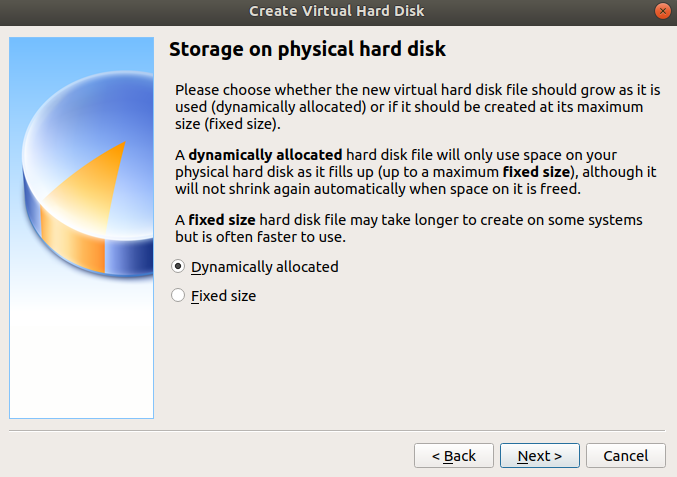  |  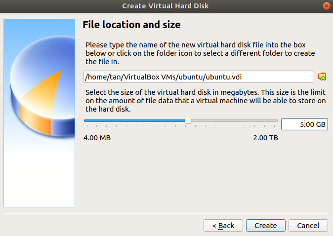

1. Configure the network settings to have a **NAT adaptor** 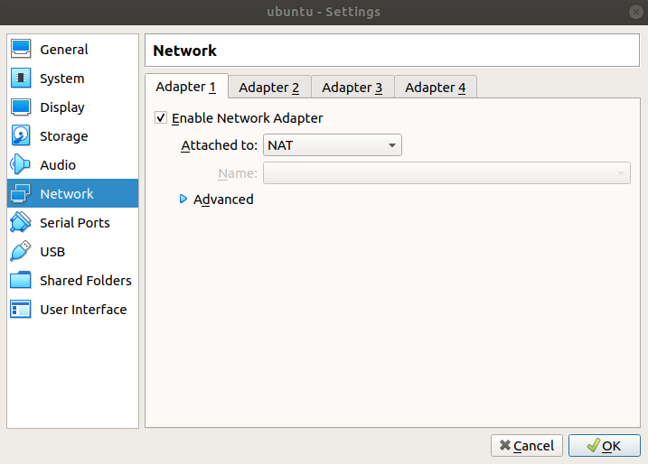
2. Boot the virtual machine using the [**Ubuntu 18.04 ISO**](http://releases.ubuntu.com/18.04/ubuntu-18.04.3-live-server-amd64.iso) and execute the installation process with the following specifications:

|  |  |
| - | - |
| Language | English |
| Network | enp0s3* |
| Proxy | ***N*/A** |
| Archive Mirror | ***Default*** |
| Filesystem | Manual |
| Available Devices | VBOX_HARDDISK |
| Format | ext4 |
| Mount | 2.99** |
| Mount | / |
| Format | ext4 |
| Name | ***Choose*** |
| Server Name | ***Choose*** |
| Username | ***Choose*** |
| Password | ***Choose*** |
| OpenSSH | True |
| Server Snaps | **N/A** |
| - | - |

*\*May vary based on computer network*

*\*\*Image shows 2.99 GB because I created a new VM to take the picture*

| | |
|:-:|:-:|
  |  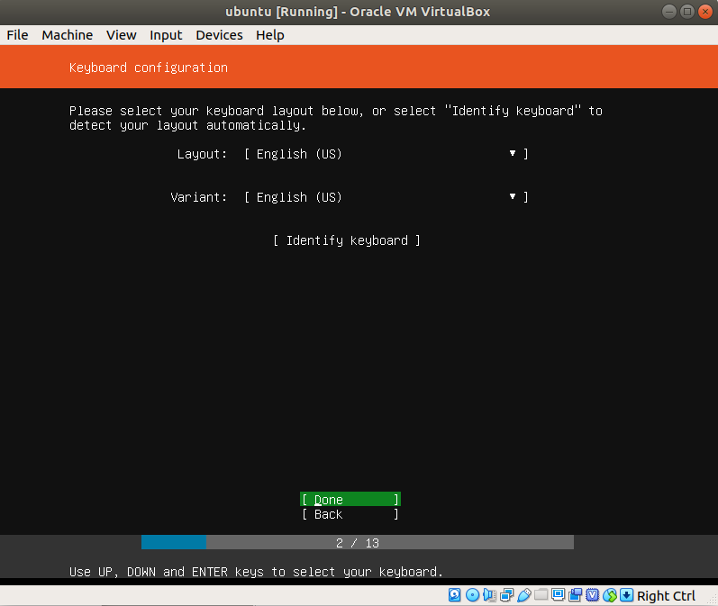
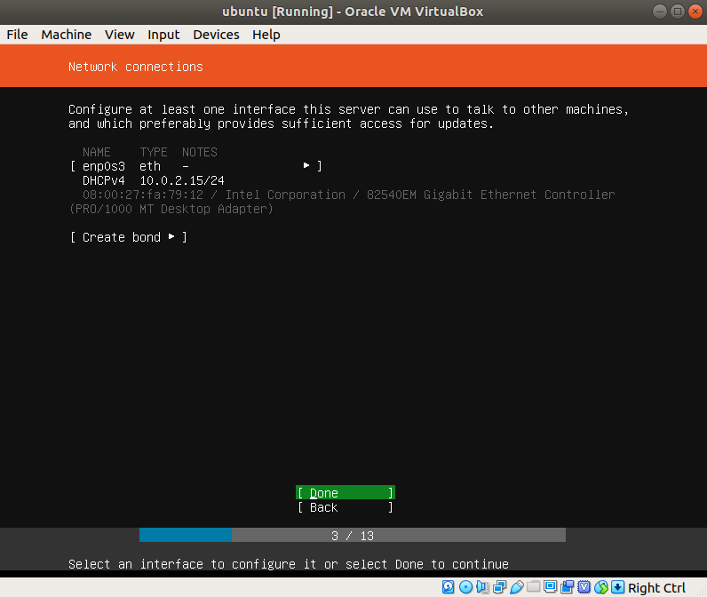  |  
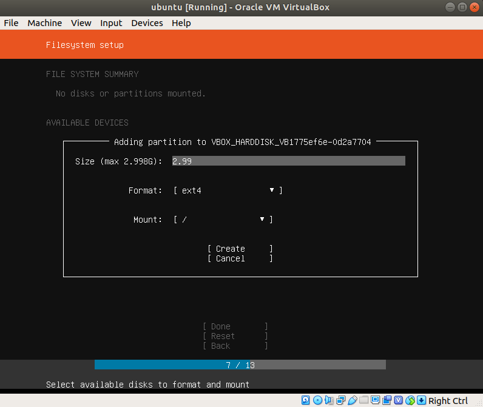  |  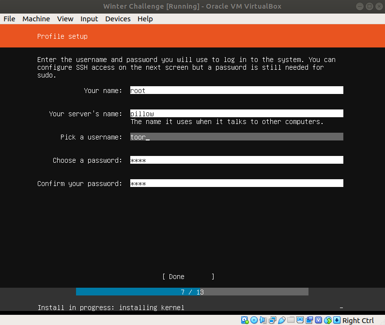
| - | - |

4. Remove the boot device and change the network settings to **Internal Network**
   
| | |
|:-:|:-:|
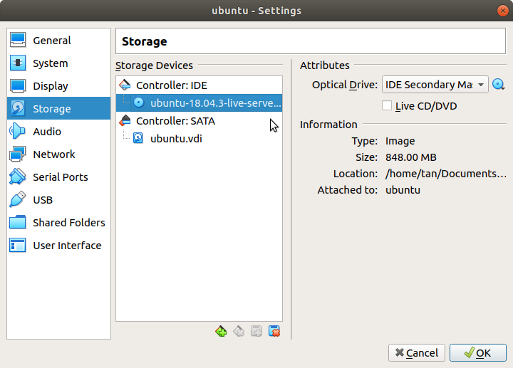  |  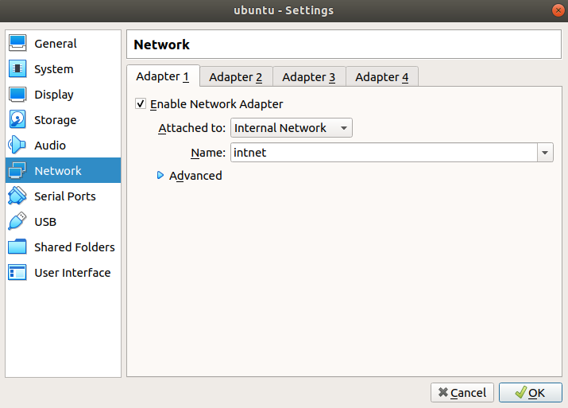
| - | - |

## Adding Guest Additions
### **Ultimately, I gave up on Guest Additions because it didn't work. Will come back to it in the future**
1. ~~Now I need to install guest additions.~~
   >***Guest Additions*** are simply a series of tools that help integrate the virtual machine with the machine running the VM. Having installed guest additions, users can use the **drag-and-drop**, **shared clipboard**, and **shared folders** functionalities etc.
2. ~~CDT Nzia Youtchom helped me find the the very helpful virtualzero's [blog](https://virtualzero.net/blog/how-to-install-virtualbox-guest-additions-in-ubuntu-server-18.04-lts), which ran me through how to set up guest additions on ubuntu. The commands are as follows:~~
```
sudo mount /dev/cdrom /mnt
  
cd /mnt 

sudo apt-get install -y dkms 
build-essential linux-headers-generic linux-headers-$(uname -r)

sudo su

./VBoxLinuxAdditions.run

reboot
```

## [CentOS Stream 8](http://isoredirect.centos.org/centos/8-stream/isos/x86_64/CentOS-Stream-8-x86_64-20191219-dvd1.iso)
1. Setup up the [CentOS Virtual Box](http://isoredirect.centos.org/centos/8-stream/isos/x86_64/CentOS-Stream-8-x86_64-20191219-dvd1.iso) the same way you would the Ubuntu Virtual Box (*Step 1 & 2*), but allocate **10 GB** for the **hard disk size** because the CentOS image the link directs to includes a GUI interface and therefore requires a little more than 8GB of storage for the boot process. 
2. The boot process mirrors the Ubuntu boot process (*Step 3*). You must partition the hard disk and setup your username and password 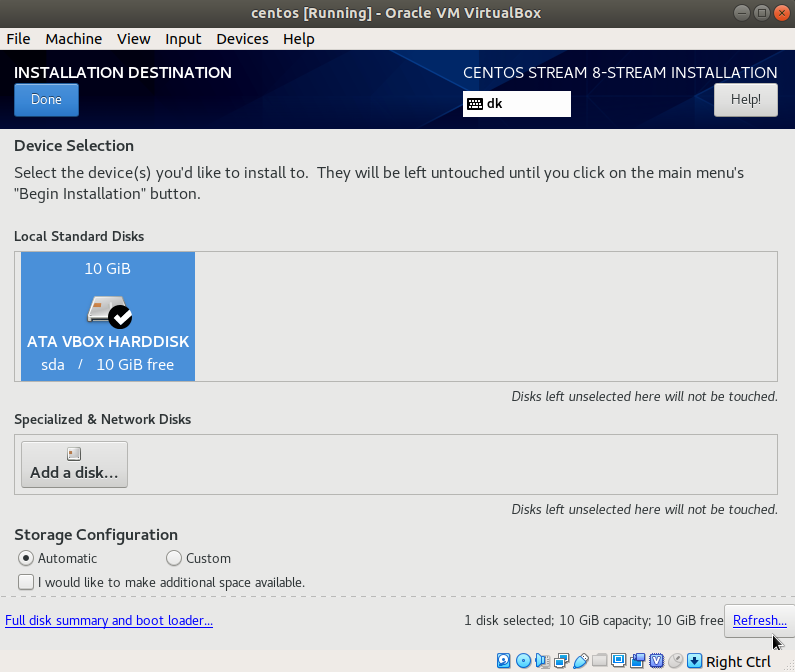
3. Once again, remove the boot disk and change the network settings to **internal network**

| | |
|:-:|:-:|
  |  

## [Alpine Linux](http://dl-cdn.alpinelinux.org/alpine/v3.10/releases/x86/alpine-extended-3.10.3-x86.iso)
1. Setup up the Alpine Linux Virtual Box the same way you would the Ubuntu Virtual Box(*Step 1 & 2*), but allocate only **3 GB** for the **hard disk size** because the Alpine Linux image is a very minimal Operating System.
2. One you get to the main screen, login with username as ***root***, which is the default login name for AlpineLinux. type `setup-alpine` and proceed to boot the image with the following commands:

|  |  |
| - | - |
| Keyboard Layout | `us` |
| Available Variant | `us` |
| Host Name | ***Choose*** |
| Network Interface | eth0* |
| Ip Address | dhcp |
| Manual Network | No |
| Password | ***Choose*** |
| Timezone | ***Choose*** |
| Proxy | **None** |
| NTP Client | Chrony |
| Mirror Image | `f` |
| SSH Server | openssh |
| Disk | `sda` |
| Use | `sys` |
| Erase Disk | Yes |
| - | - |

*\*May vary based on computer network*

3. Once again, remove the boot disk and change the network settings to **internal network**

## [pfSense](https://nyifiles.pfsense.org/mirror/downloads/pfSense-CE-2.4.4-RELEASE-amd64.iso.gz)

1. Unzip the file to pfSense file
   ```
   gunzip pfSense-CE-2.4.4-RELEASE-amd64.iso.gz
   ```
2. Setup up the pfSense Virtual Box the same way you would the Ubuntu Virtual Box(*Step 1 & 2*).

3. Boot the virtual machine using the [***pfSense iso***](https://nyifiles.pfsense.org/mirror/downloads/pfSense-CE-2.4.4-RELEASE-amd64.iso.gz) and execute the installation process with the following specifications:

|  |  |
| - | - |
| Language | English |
| Network | enp0s3* |
| Proxy | ***N*/A** |
| Archive Mirror | ***Default*** |
| Filesystem | Manual |
| Available Devices | VBOX_HARDDISK |
| Format | ext4 |
| Mount | 2.99** |
| Mount | / |
| Format | ext4 |

# Connect all machines
## Internal network
At this point
## pfsense

# Setup Nginx Website
1. [Create a privileged user account](#New-User)
2. ~~[Setup Alpine to build packages](https://wiki.alpinelinux.org/wiki/Include:Setup_your_system_and_account_for_building_packages)~~
3. Download and configure nginx
4. Troubleshooting

## [New User](https://wiki.alpinelinux.org/wiki/Setting_up_a_new_user)
Alpine linux is a pretty bare bones OS. You need to enable essential packages used to build new packages like sudo, gcc and file.

`apk add alpine-sdk`

After you initally setup your box, you will be working in the root account. Don't do that. Root accounts are for managing. Instead, you want to make a [user account](https://wiki.alpinelinux.org/wiki/Setting_up_a_new_user).

`adduser <your_username_here>`

You can doublecheck that the account you added was created by grepping for it in `/etc/passwd`. FYI, grep is installed after typing `apk add alpine-dsk`

`cat /etc/passwd | grep <your_username_here>`

The Alpine Linux wiki recommends you enable the newly created user account with sudo privileges. This will make the rest of the process easier, however just know it will also potentially make your Alpine box more vulnerable (Any users with sudo privleges makes a box vulnerable). You can enable sudo privileges to an account by adding it to the `/etc/sudoers` configuration file using the command `visudo`.


`visudo`
* press `i` to start editing
* press `esc` to stop editing
* press `esc` and then type `:+w+enter` to save
* press `esc` and then type `:+q+enter` to quit
* press `esc` and the `u` to undo

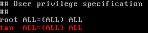

Now logout of your root account and login to your newly created user account using `exit` (Just keep typing it until you are brought to the login page)


## ~~Creating Alpine Packages~~
<s>
Once you are in your user account:
1. Connect to your github
2. Download aports tree.
3. Configure abuild

>Aports Tree is a github repository that enables you to use `abuild` to download any package/program you ever need

```
git config --global user.name "Your Full Name"
git config --global user.email "your@email.address"
git clone git://git.alpinelinux.org/aports
sudo vi /etc/abuild.conf
```
***Note: I just realized editing the config is unecessary (Read the [documentation page](https://wiki.alpinelinux.org/wiki/Include:Setup_your_system_and_account_for_building_packages))

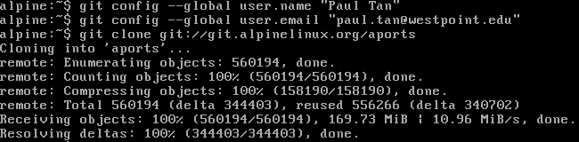
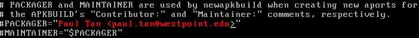

Finally, type the following to be able to properly install dependency packages.

```
sudo addgroup <yourusername> abuild
sudo mkdir -p /var/cache/distfiles
sudo chmod a+w /var/cache/distfiles
abuild-keygen -a -i
```
When you generate your key, you can just type `enter` when prompted for a file to save the key.
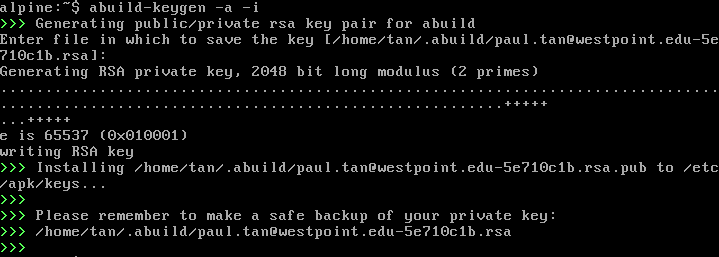

If you have any questions about what you just did, read the [official guide](https://wiki.alpinelinux.org/wiki/Include:Setup_your_system_and_account_for_building_packages).
</s>

## Download Apache


```
tcpdump -n -v port 80
```
### 
settingup [pfSense](https://www.youtube.com/watch?v=9kSZ1oM-4ZM)

https://wiki.alpinelinux.org/wiki/Nginx


https://www.wweek.com/resizer/86tt-U3ytIrtb7bBYXAIg7XWz7A=/1200x0/filters:quality(100)/s3.amazonaws.com/arc-wordpress-client-uploads/wweek/wp-content/uploads/2019/08/30145212/Nicolas-Cage.jpg
https://tenor.com/view/nicolas-cage-nic-cage-gif-7519899

## Setup Unbound
1. Download Unbound
      ```
      sudo yum update -y
      sudo yum install unbound -y
      ```
2. Apparently you always need to copy your config files to make sure you have a backup
      ```
      cp /etc/unbound/unbound.conf /etc/unbound/unbound.conf.original
      ```
3. Next edit the config files to have the following configurations for an authoritative, validating, recursive caching DNS. [Calomel](https://calomel.org/unbound_dns.html) has excellent instructions on how to setup such a server. There are two precursor steps to setup this server:
   1. Add **root-hints** which is a list of primary root DNS servers
      ```
      wget ftp://FTP.INTERNIC.NET/domain/named.cache -O /var/lib/unbound/root.hints
      ```
   2. Add an **auto-trust-anchor-file**, which contains the key for the root server so DNSSEC can be validated. Make sure you move the following code inside the "};" of *trusted-keys*
      ```
      echo "." IN DS 20326 8 2 E06D44B80B8F1D39A95C0B0D7C65D08458E880409BBC683457104237C7F8EC8D >> /etc/unbound/root.key
      ```
4. Edit the /etc/unbound/unbound.config files. Code unique to this unbound server that differs from the code from [Calomel](https://calomel.org) include the following: 
   1. Additional `access-control: 192.168.1.0/24 allow`
   2. The CentOS VM runs on 3 threads `num-threads: 4`
   3. All instances of `home.lan` replaced by `PillowFood.c3t`
   4. The portion of `local-zone`, `local-data`, and `local-data-ptr` shorted to following(IP address also changed to DHCP address of pfSense)
   ```
   local-zone: "PillowFood.c3t." static
   local-data: "firewall.PillowFood.c3t.  IN A 10.15.2.63"
   local-data-ptr: "10.15.2.63  firewall.PillowFood.c3t"
   ```
   1. Added a forward-zone:
   ```
   forward-zone:
    name: "PillowFood.c3t"
    forward-addr: 10.15.0.62
   ```
   ***/etc/unbound/unbound.config file:**
      ```
      ## Authoritative, validating, recursive caching DNS
      ## unbound.conf -- https://calomel.org
      #
      server:
      # log verbosity
      verbosity: 1

      # specify the interfaces to answer queries from by ip-address.  The default
      # is to listen to localhost (127.0.0.1 and ::1).  specify 0.0.0.0 and ::0 to
      # bind to all available interfaces.  specify every interface[@port] on a new
      # 'interface:' labeled line.  The listen interfaces are not changed on
      # reload, only on restart.
      interface: 127.0.0.1

      # port to answer queries from
      port: 53

      # Enable IPv4, "yes" or "no".
      do-ip4: yes

      # Enable IPv6, "yes" or "no".
      do-ip6: no

      # Enable UDP, "yes" or "no".
      do-udp: yes

      # Enable TCP, "yes" or "no". If TCP is not needed, Unbound is actually
      # quicker to resolve as the functions related to TCP checks are not done.i
      # NOTE: you may need tcp enabled to get the DNSSEC results from *.edu domains
      # due to their size.
      do-tcp: yes

      # control which client ips are allowed to make (recursive) queries to this
      # server. Specify classless netblocks with /size and action.  By default
      # everything is refused, except for localhost.  Choose deny (drop message),
      # refuse (polite error reply), allow (recursive ok), allow_snoop (recursive
      # and nonrecursive ok)
      access-control: 10.0.0.0/8 allow
      access-control: 127.0.0.0/8 allow
      access-control: 192.168.0.0/16 allow
      access-control: 192.168.1.0/24 allow

      # Read  the  root  hints from this file. Default is nothing, using built in
      # hints for the IN class. The file has the format of  zone files,  with  root
      # nameserver  names  and  addresses  only. The default may become outdated,
      # when servers change,  therefore  it is good practice to use a root-hints
      # file.  get one from https://www.internic.net/domain/named.root 
      root-hints: "/var/unbound/etc/root.hints"

      # enable to not answer id.server and hostname.bind queries.
      hide-identity: yes

      # enable to not answer version.server and version.bind queries.
      hide-version: yes

      # Will trust glue only if it is within the servers authority.
      # Harden against out of zone rrsets, to avoid spoofing attempts. 
      # Hardening queries multiple name servers for the same data to make
      # spoofing significantly harder and does not mandate dnssec.
      harden-glue: yes

      # Require DNSSEC data for trust-anchored zones, if such data is absent, the
      # zone becomes  bogus.  Harden against receiving dnssec-stripped data. If you
      # turn it off, failing to validate dnskey data for a trustanchor will trigger
      # insecure mode for that zone (like without a trustanchor).  Default on,
      # which insists on dnssec data for trust-anchored zones.
      harden-dnssec-stripped: yes

      # Use 0x20-encoded random bits in the query to foil spoof attempts.
      # http://tools.ietf.org/html/draft-vixie-dnsext-dns0x20-00
      # While upper and lower case letters are allowed in domain names, no significance
      # is attached to the case. That is, two names with the same spelling but
      # different case are to be treated as if identical. This means calomel.org is the
      # same as CaLoMeL.Org which is the same as CALOMEL.ORG.
      use-caps-for-id: yes

      # the time to live (TTL) value lower bound, in seconds. Default 0.
      # If more than an hour could easily give trouble due to stale data.
      cache-min-ttl: 3600

      # the time to live (TTL) value cap for RRsets and messages in the
      # cache. Items are not cached for longer. In seconds.
      cache-max-ttl: 86400

      # perform prefetching of close to expired message cache entries.  If a client
      # requests the dns lookup and the TTL of the cached hostname is going to
      # expire in less than 10% of its TTL, unbound will (1st) return the ip of the
      # host to the client and (2nd) pre-fetch the dns request from the remote dns
      # server. This method has been shown to increase the amount of cached hits by
      # local clients by 10% on average.
      prefetch: yes

      # number of threads to create. 1 disables threading. This should equal the number
      # of CPU cores in the machine. Our example machine has 4 CPU cores.
      num-threads: 4


      ## Unbound Optimization and Speed Tweaks ###

      # the number of slabs to use for cache and must be a power of 2 times the
      # number of num-threads set above. more slabs reduce lock contention, but
      # fragment memory usage.
      msg-cache-slabs: 8
      rrset-cache-slabs: 8
      infra-cache-slabs: 8
      key-cache-slabs: 8

      # Increase the memory size of the cache. Use roughly twice as much rrset cache
      # memory as you use msg cache memory. Due to malloc overhead, the total memory
      # usage is likely to rise to double (or 2.5x) the total cache memory. The test
      # box has 4gig of ram so 256meg for rrset allows a lot of room for cacheed objects.
      rrset-cache-size: 256m
      msg-cache-size: 128m

      # buffer size for UDP port 53 incoming (SO_RCVBUF socket option). This sets
      # the kernel buffer larger so that no messages are lost in spikes in the traffic.
      so-rcvbuf: 1m

      ## Unbound Optimization and Speed Tweaks ###


      # Enforce privacy of these addresses. Strips them away from answers.  It may
      # cause DNSSEC validation to additionally mark it as bogus.  Protects against
      # 'DNS Rebinding' (uses browser as network proxy).  Only 'private-domain' and
      # 'local-data' names are allowed to have these private addresses. No default.
      private-address: 192.168.0.0/16
      private-address: 172.16.0.0/12
      private-address: 10.0.0.0/8

      # Allow the domain (and its subdomains) to contain private addresses.
      # local-data statements are allowed to contain private addresses too.
      private-domain: "PillowFood.c3t"

      # If nonzero, unwanted replies are not only reported in statistics, but also
      # a running total is kept per thread. If it reaches the threshold, a warning
      # is printed and a defensive action is taken, the cache is cleared to flush
      # potential poison out of it.  A suggested value is 10000000, the default is
      # 0 (turned off). We think 10K is a good value.
      unwanted-reply-threshold: 10000

      # IMPORTANT FOR TESTING: If you are testing and setup NSD or BIND  on
      # localhost you will want to allow the resolver to send queries to localhost.
      # Make sure to set do-not-query-localhost: yes . If yes, the above default
      # do-not-query-address entries are present.  if no, localhost can be queried
      # (for testing and debugging). 
      do-not-query-localhost: no

      # File with trusted keys, kept up to date using RFC5011 probes, initial file
      # like trust-anchor-file, then it stores metadata.  Use several entries, one
      # per domain name, to track multiple zones. If you use forward-zone below to
      # query the Google DNS servers you MUST comment out this option or all DNS
      # queries will fail.
      # auto-trust-anchor-file: "/var/unbound/etc/root.key"

      # Should additional section of secure message also be kept clean of unsecure
      # data. Useful to shield the users of this validator from potential bogus
      # data in the additional section. All unsigned data in the additional section
      # is removed from secure messages.
      val-clean-additional: yes

      # Blocking Ad Server domains. Google's AdSense, DoubleClick and Yahoo
      # account for a 70 percent share of all advertising traffic. Block them.
      # local-zone: "doubleclick.net" redirect
      # local-data: "doubleclick.net A 127.0.0.1"
      # local-zone: "googlesyndication.com" redirect
      # local-data: "googlesyndication.com A 127.0.0.1"
      # local-zone: "googleadservices.com" redirect
      # local-data: "googleadservices.com A 127.0.0.1"
      # local-zone: "google-analytics.com" redirect
      # local-data: "google-analytics.com A 127.0.0.1"
      # local-zone: "ads.youtube.com" redirect
      # local-data: "ads.youtube.com A 127.0.0.1"
      # local-zone: "adserver.yahoo.com" redirect
      # local-data: "adserver.yahoo.com A 127.0.0.1"
      # local-zone: "ask.com" redirect
      # local-data: "ask.com A 127.0.0.1"


      # Unbound will not load if you specify the same local-zone and local-data
      # servers in the main configuration as well as in this "include:" file. We
      # suggest commenting out any of the local-zone and local-data lines above if
      # you suspect they could be included in the unbound_ad_servers servers file.
      #include: "/etc/unbound/unbound_ad_servers"

      # locally served zones can be configured for the machines on the LAN.

      local-zone: "PillowFood.c3t." static
      local-data: "firewall.PillowFood.c3t.  IN A 10.15.2.63"
      local-data-ptr: "10.15.2.63  firewall.PillowFood.c3t"

      # Unbound can query your NSD or BIND server for private domain queries too.
      # On our NSD page we have NSD configured to serve the private domain,
      # "PillowFood.c3t". Here we can tell Unbound to connect to the NSD server when it
      # needs to resolve a *.PillowFood.c3t hostname or IP.
      #
      # private-domain: "PillowFood.c3t"
      # local-zone: "0.0.10.in-addr.arpa." nodefault
      # stub-zone:
      #      name: "PillowFood.c3t"
      #      stub-addr: 10.15.2.6311@53

      # If you have an internal or private DNS names the external DNS servers can
      # not resolve, then you can assign domain name strings to be redirected to a
      # seperate dns server. For example, our comapny has the domain
      # organization.com and the domain name internal.organization.com can not be
      # resolved by Google's public DNS, but can be resolved by our private DNS
      # server located at 1.1.1.1. The following tells Unbound that any
      # organization.com domain, i.e. *.organization.com be dns resolved by 1.1.1.1
      # instead of the public dns servers.
      #
      # forward-zone:
      #    name: "organization.com"
      #    forward-addr: 1.1.1.1        # Internal or private DNS

      # Use the following forward-zone to forward all queries to Google DNS,
      # OpenDNS.com or your local ISP's dns servers for example. To test resolution
      # speeds use "drill calomel.org @8.8.8.8" and look for the "Query time:" in
      # milliseconds.
      #
      forward-zone:
      name: "."
      forward-addr: 1.1.1.1@53#one.one.one.one
      forward-addr: 8.8.8.8@53#dns.google
      forward-addr: 9.9.9.9@53#dns.quad9.net
      forward-addr: 1.0.0.1@53#one.one.one.one
      forward-addr: 8.8.4.4@53#dns.google
      forward-addr: 149.112.112.112@53#dns.quad9.net

      #
      #
      ## Authoritative, validating, recursive caching DNS
      ## unbound.conf -- https://calomel.org
      ```
*Note: From here on I used the video by [dolastack devops](https://www.youtube.com/watch?=ys3JWXdyfMI)*
5. Check to make sure there are no errors in the config file using the command:
   ```
   unbound-checkconf
   ```
6. Start, check, and test the server (*Notice that on the second time)
   ```
   systemctl start unbound
   systemctl status unbound
   dig google.com
   dig google.com
   ```
      | | |
      |:-:|:-:|
      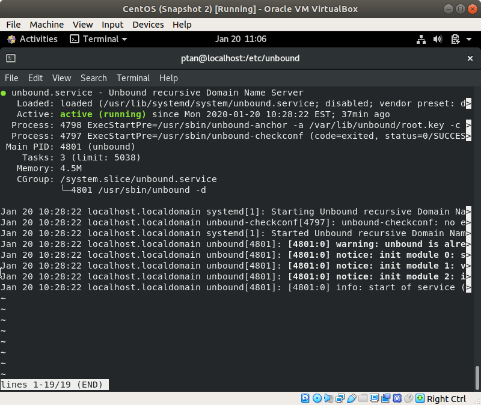  |
      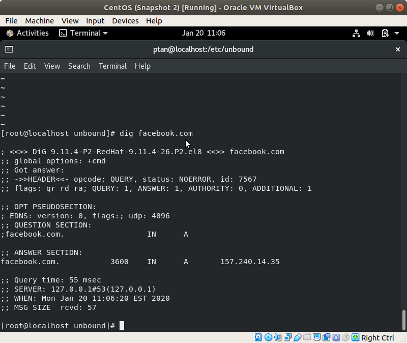  |  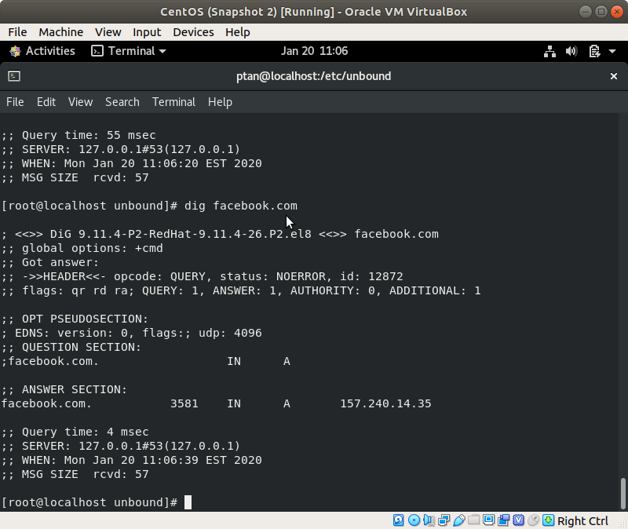
      | - | - |
7. Finally, hookup the alpineBox to the unbound server.
   1. **First** make sure the CentOS firewall isn't blocking DNS(Red highlighted portion indicates cockpit, dhcp, and ssh are allowed)
   ```
   firewall-cmd --list-all
   firewall-cmd --get-services | grep dns
   firewall-cmd --add-service=dns --permanent
   firewall-cmd --reload
   ```
      | | |
      |:-:|:-:|
      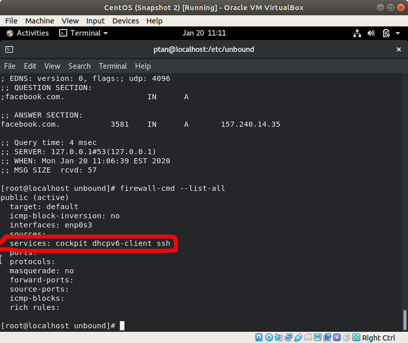  |  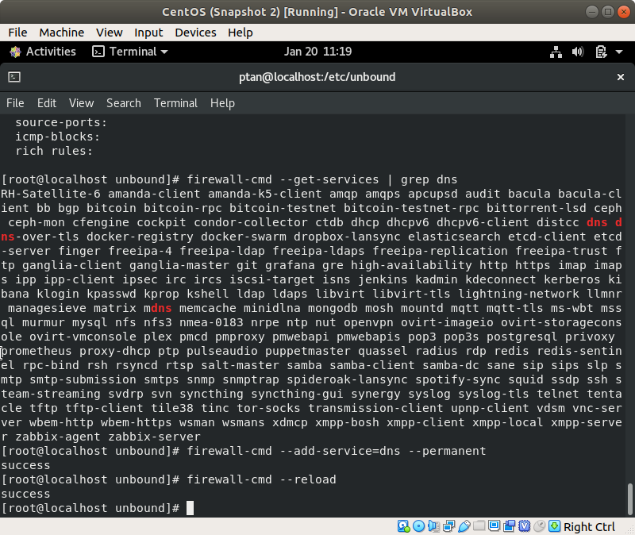
      | - | - |


https://learn.akamai.com/en-us/webhelp/enterprise-threat-protector/enterprise-threat-protector/GUID-50A942A0-B474-488E-9A79-3ED0E5E88226.html
