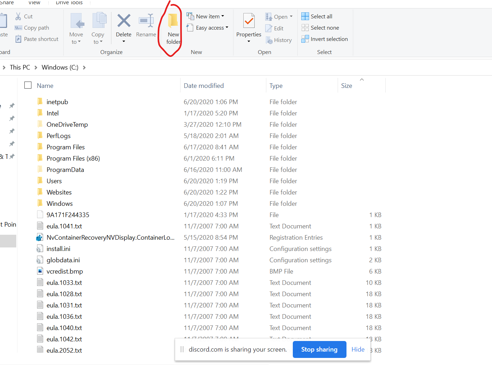

# Setting up a webpage in Windows Internet Information Services (IIS)

*Written and tested by [43y3s](https://github.com/incub4t0r)*

## **Table of Contents**

1. [Internet Information Services (IIS)](#IIS)
    1. [Background](#Background)
    1. [Installing IIS](#Installing-IIS)
    1. [Checking installation](#Checking-installation)
2. [Creating your first website](#Creating-our-first-website)
    1. [Pre-reqs](#Pre-reqs)
    2. [Making the site](#Making-the-site)
3. [Troubleshooting](#Troubleshooting)
4. [Uninstalling IIS](#Uninstalling-IIS)

## **IIS**
### Background
Websites are comprised of code (html, css, python etc). In order to convert the code into a visible site, you need to use a service/software that can process the code. Of the three most popular webserver softwares (Apache, Nginx, IIS), IIS is the one that can *only* run on Windows operating systems.

| IIS | Apache | Nginx |
| :-: | :-: | :-: |
|  |  |  |

### Installing IIS

1.  Hit the windows key and start typing `Turn Windows` and select `Turn Windows features on or off`.
2.  Scroll to find `Internet Information Services`.
3.  Make sure the `Internet Information Services` box is checked. `FTP Server` should not be checked, but `Web Management Tools` and `World Wide Web Services` should be.

| Step 3 |
| :-: |
|  |

4.  Press OK, and reboot computer.

### Checking installation

Open a browser tab, and navigate to `http://localhost` in the search bar, and you should be met with a blue webpage shown below.

| Check to see IIS is running |
| :-: |
|  |

## **Creating your first website**
Now that you have your webserver, you can upload the code for your website! But first...
### Pre-reqs
Before configuring the IIS software, you need to create a directory (folder) to host your website code.
1. Open File Explorer
2. Navigate to `This PC`, then `Windows (C:)`
3. Create a new folder named `Websites`. Inside of that folder, create a new folder named `SIGSAC_Site_1`

All your website files will live inside of this directory.

| Step 1 | Step 2 |
| :-: | :-: |
|  |  |

### **Making the site**

1. After installation of IIS, creating and hosting your own website is fairly simple.
2. Hit the windows key and type in `IIS` and select `Internet Information Services (IIS) Manager`, which should bring up a control panel for all IIS services.

3. ***Disable the `Default Web Site` by right clicking `Default Web Site`, selecting `Manage Website`, then `Stop`***

4. Right click on `Sites`, and select `Add Website`. This should bring up a control panel named `Add Website`, shown below.

6. Download the sample html webpage [here](https://github.com/PillowFood/SIGSAC/raw/master/5.%20Your%20Very%20Own%20Website/assets/files/index.html), and place it into the new directory, `C:\Websites\MyWebsite`
7. Navigate to `http://localhost` once more and you should see your new website. Congrats!

## **Troubleshooting**

## **Uninstalling IIS**

- Hit the windows key and start typing `Turn Windows` and select `Turn Windows features on or off`.
- Scroll to find `Internet Information Services`.
- Check the box to empty
- Press OK.
- Allow computer to reboot as necessary.

<!--So what does IIS do? It simply shows people who show up, the files that live in your websites directory. Think of it as someone showing up to your house, and then looking at your doormat. -->

<!--Also, congrats if you found this lmao -->
