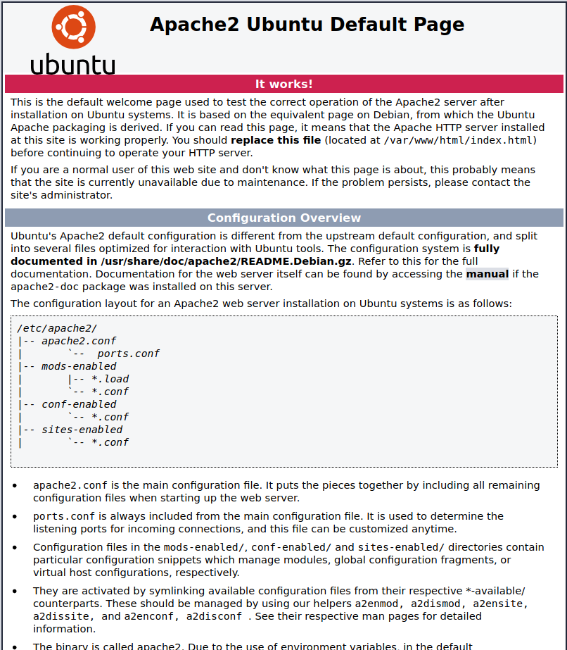

# Playing with Django
In this collaboration with Deez, we set up a simple Django webserver
_____
We used the following resources and tools:
1. Resources
   1. [Python Django Crash Course](https://www.youtube.com/watch?v=e1IyzVyrLSU) by Traversy Media
In doing this project, we used the following tools:
2. Programs
   1. Virtual Studio
      1. Remote - SSH
   2. VirtualBox
      1. Ubuntu 18.04.3 Live Server
      2. Ubuntu 18.04.3 Desktop
3. Software
   1. Pip
   2. Django
   3. Apache
   4. MySQL
____

# Initial Setup
## Setup Boxes
We installed two VM's, one to act as a server, one to act as a client.

1. Server: [Ubuntu 18.04.3 Live Server](http://releases.ubuntu.com/18.04/ubuntu-18.04.3-live-server-amd64.iso). Install with 20gb for safe measures. 
2. Client: [Ubuntu 18.04.3 Desktop](https://ubuntu.com/download/desktop/thank-you?version=18.04.3&architecture=amd64)

We then changed the network settings for both boxes, in order for the client to communiate and connect to the server.
1. Go to network settings for the server, add Adapter 2 as internal network named djangonet.
2. Go to network settings for client, and change Adapter 1 to internal network named djangonet. 


## Setting up Django
***Django Purpose:***

Using linuxize's [guide](https://linuxize.com/post/how-to-install-pip-on-ubuntu-18.04/), I installed pip3 onto my server
```
sudo apt install python3-pip
```
Using Django's official [website](https://docs.djangoproject.com/en/3.0/topics/install/), I installed DJango
```
python -m pip install Django
```
```
django-admin startproject django1
```
You can view the project using the following code:
```
ssh [ip_address] -L 8000:127.0.0.1:8000
```

## Setting up Apache
***Apache Purpose:*** host django/python, html, php web files for the website*

Using DigitalOcean's [guide](https://www.digitalocean.com/community/tutorials/how-to-install-the-apache-web-server-on-ubuntu-18-04), we setup Apache.


*It is recommended that you use the most restrictive firewall for security purposes, therefore we will only allow Apache through ufw.*

Update and Install
```
sudo apt update
sudo apt install apache2
```
Enable Firewall to allow Apache
```
sudo ufw app list
sudo ufw allow 'Apache'
sudo ufw enable
sudo ufw status
```
Check to seem if Apache is running, and *enable* it (Automatically start up each time the box restarts)
```
sudo systemctl status apache2
sudo systemctl enable apache2
```
You can now visit the website to double check it is running. Use the ip address you get from ```hostname -i```




## Setting up MySQL
***MySQL Purpose:***
*The purpose of setting up MySQL is to setup a database where you store website data.*

```
sudo apt install mysql-server
sudo ufw enable
sudo ufw allow 'MySQL'
sudo systemctl status mysql.service
sudo systemctl enable mysql
```

## Setting up Remote-SSH
*The purpose of setting up Remote-SSH is to access the server box and edit files from our machine (cadet laptop)*

Download and install remote-ssh for Visual Studio on your machine

In the box, allow OpenSSH through ufw
```
sudo ufw allow 'OpenSSH'
sudo ufw status
```

# Building the Website
To be continued

# Future additions
1. Configure SSL for Apache


Hello this is a test
1. one
2. two
3. three