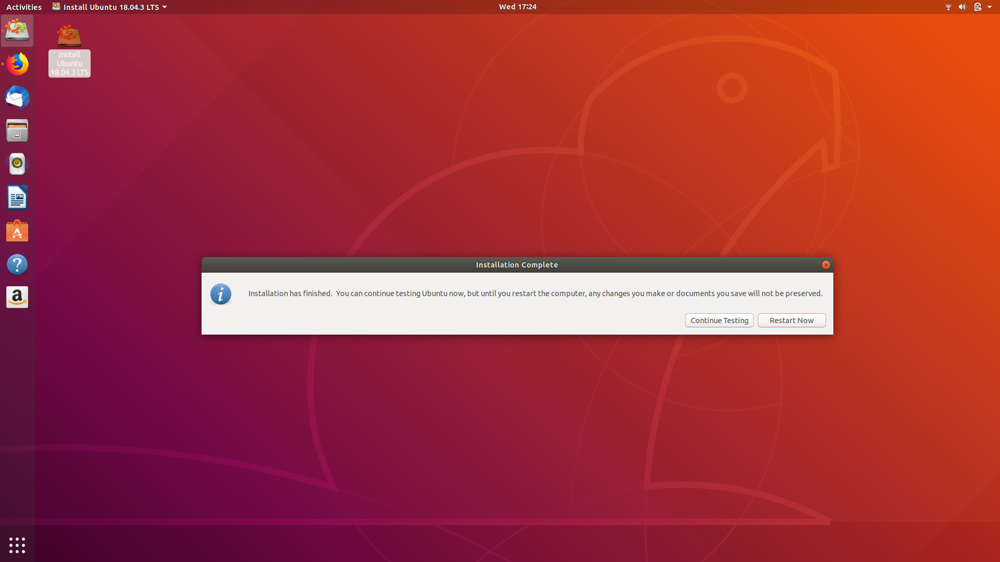

# Outline
### You've received your team laptop. Here is what you should do:
 
1. [Laptop Setup](#Laptop-Setup)
2. [Github Setup](#Github-Setup)
3. [Practice](#Practice)
   
# Laptop Setup

Reboot your computer and hit `F12` as it is booting up. Select the medium you want to install from (San Disk). 
Install Ubuntu with the following:

1. Open your laptop and click Install Ubuntu
   
2. Select English
   
3. Select English(US)
   
4. Minimal Installation w/ updates & third-party software
   
5. Erase Disk and Install Ubuntu
   
6. Continue (if the following screen popsup)
   
7. New York
   
8. Customize your computer
   
9.  Wait for Installation
    
10. Restart computer


# Github Setup
Once you have a clean Ubuntu 18.04 image, set up your GitHub:

>### Github in a nutshell
>Github lets you collaborate on files with other people. 
>1. First, you need access to a repository (*a special folder that is both hosted on GitHub servers and also downloaded to your local machine*)
>2. Next, you can edit the code file on your computer with a text editor (Notepad, Sublime, Atom, Vim, Visual Studio etc)
>3. After, you will **add** the file a queue, **commit** those changes (make sure to add a comment), and then **push** them from the queue to GitHub's servers.


Update BASH and install git
```
sudo apt update && sudo apt install git
```


Generate a public-private key pair.
```
ssh-keygen -t ed25519 -a 256
```


### Access the "BORG" repository
1. Print the public key
```
git clone git@github.com:bitsforeveryone/borg
```


2. Login to GitHub
   
3. Go to Settings
   
4. Configure SSH & GPG keys
   
5. Paste public key
   
6. Clone Team repository(BORG)
```
git clone git@github.com:bitsforeveryone/borg
```


## Download Team Tools
1. Run script to download Team tools
```
./borg/infra/laptops/c3t.sh
```


2. Allow all users to run Wireshark 
   
3. VMWare Workstation 15.5 Pro Setup
   1. Accept Terms

   3. Allow Updates

   4. Your Choice

   5. Automatic

   6. Automatic

   7. Use Port 443

   8. Enter Confirmation Key: `44284-XZJ05-N8VD4-0A0H6-28VPJ`