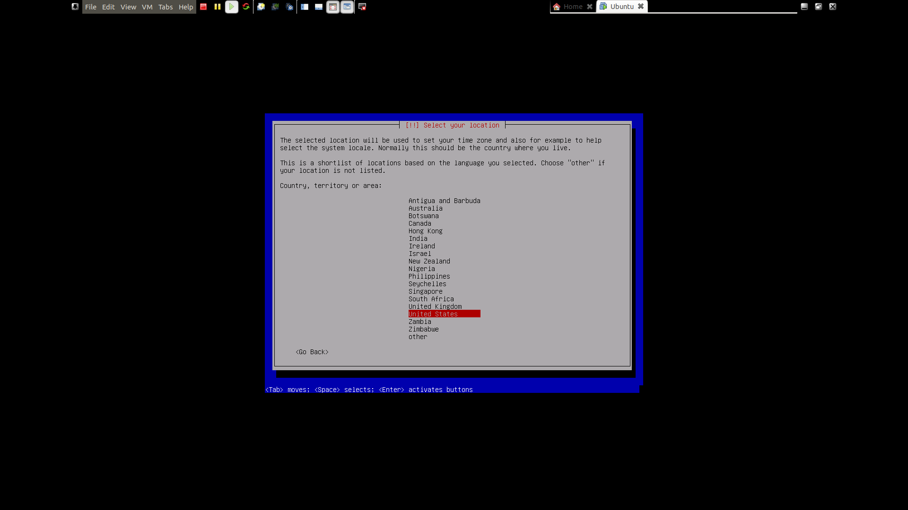

# Outline
### This is my exploration into Kali Linux. Join me and become elite.

### Table of Contents
1. [Installation](#Installation)
2. [Fundamentals](#Fundamentals)
3. [What is Markdown?](#Markdown-in-a-nutshell)

# Installation
Download [Kali Linux 64-Bit](https://www.kali.org/downloads/)\
Install Guest Operating System [Kali Official Guide](https://www.kali.org/docs/base-images/kali-linux-hard-disk-install/)\
Install VMWare Tools [VMWare Official Guide](http://partnerweb.vmware.com/GOSIG/Ubuntu_18_04_LTS.html)

### Specs

### Setup
1. Create a new Virtual Machine w/ Typical configurations\
2. Import the downloaded Kali .iso
3. Use the Linux Guest Operating System
4. Give the VM a name of your choice
5. Set the Disk Size
6. Create the Virtual Machine
6. Advanced Settings - I am using the default settings. May be liable to change in the future
7. This is a reminder that I will need to install the Kali OS, and also VMWare Tools
8. Begin Kali Installation. I will be using the CLI as opposed to the GUI because it is a good practice to get comfortable with installing CLI operating systems such as Ubuntu Server Live or ApacheLinux. However, you can do a Graphical Install and the following steps will remain the same. Alternatively, the [Kali Official Guide](https://www.kali.org/docs/base-images/kali-linux-hard-disk-install/) actually runs through a GUI installation
9. English
10. United States
12. Domain Name Optional
13. Set Username
14. Set Password
15. Confirm Password
16. Select Time Zone
17. Choose Partition Disk. I chose an [Logical Volume (LVM) partition disk](https://askubuntu.com/questions/3596/what-is-lvm-and-what-is-it-used-for). LVM is very OS-experimenation-friendly and because this is the first time I am using Kali, I may change the specs of the system a lot in the future
18. Select SCIS33
19. All files in one partition
20. Write changes to disk I maxed out the partition (20GB allocated when the VM was created). My reasoning is that likely I will be downloading a lot of tools in this Kali. If I run out of disk space, I should be able to easily increase the size because this is an LVM.
22. Write changes to disk
23. Did not configure HTTP proxy
24. I also selected the Kali desktop environment. I'm not hardcore enough to use a CLI-only kali...yet
25. Install the [GRUB boot loader](https://askubuntu.com/questions/347203/what-exactly-is-grub)
26. Install boot loader on /dev/sda
27. Restart the system
28. Select normal bootup
29. Login
30. Nice, I just got Kali (Freaking awesome UI!)
31. Don't forget to take a snapshot. Always take snapshots